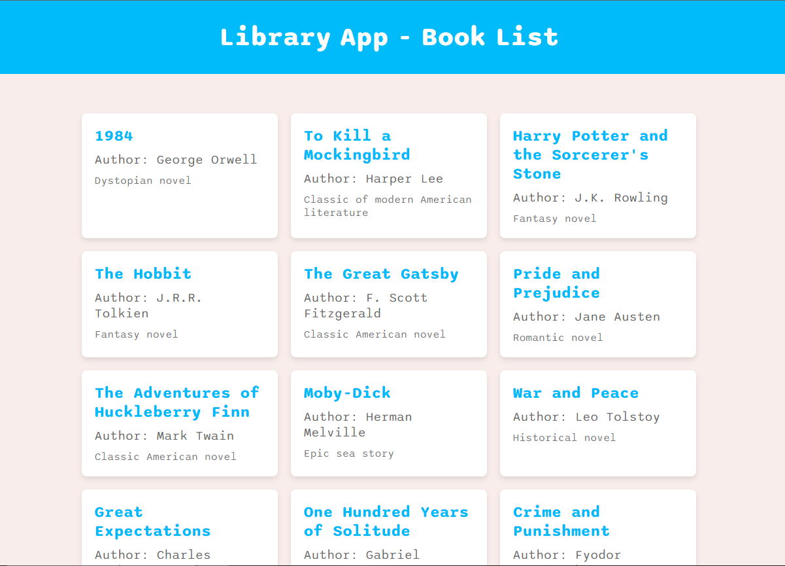

# Library App

This is a mini library project developed with Angular on the frontend and ASP.NET Core on the backend. The project's goal is to list books, with additional functionalities such as adding, editing, and deleting books.



## Technologies Used

- **Frontend**: Angular
- **Backend**: ASP.NET Core
- **Database**: None (mocked data)
- **Testing**: Jasmine and Karma (frontend), xUnit (backend, if applicable)

## Project Structure

```
LibraryApp/
├── BookAPI/                # Backend ASP.NET Core
│   ├── Controllers/
│   │   └── BooksController.cs
│   ├── Models/
│   │   └── Book.cs
│   ├── Services/
│   │   └── BookService.cs
│   ├── Program.cs
│   └── launchSettings.json
├── book-list-app/              # Frontend Angular
│   ├── src/
│   │   ├── app/
│   │   │   ├── book-list/
│   │   │   │   ├── book-list.component.html
│   │   │   │   ├── book-list.component.css
│   │   │   │   ├── book-list.component.ts
│   │   │   │   └── book-list.component.spec.ts
│   │   │   ├── book.service.ts
│   │   │   ├── book.ts
│   │   │   ├── app.module.ts
│   │   │   └── app.component.html
│   │   └── index.html
│   ├── angular.json
│   ├── package.json
│   └── README.md
```

## Backend Setup

1. **Clone the repository**:

   ```bash
   git clone https://github.com/BarbosaThaissa/LibraryApp.git
   cd library-app/BookAPI
   ```

2. **Install dependencies**:

   ```bash
   dotnet restore
   ```

3. **Run the application**:

   ```bash
   dotnet run
   ```

4. **The API will be available at**: `http://localhost:5000`

## Frontend Setup

1. **Navigate to the frontend directory**:

   ```bash
   cd library-app/book-list-app
   ```

2. **Install dependencies**:

   ```bash
   npm install
   ```

3. **Run the application**:

   ```bash
   ng serve
   ```

4. **The application will be available at**: `http://localhost:4200`

## Testing

### Backend

1. **Run backend tests**:
   ```bash
   dotnet test
   ```

### Frontend

1. **Run frontend tests**:
   ```bash
   ng test
   ```

## Data Structure

### Book

```typescript
export interface Book {
  id: number;
  title: string;
  author: string;
  description: string;
}
```

## Contribution

1. **Fork the repository**
2. **Create a branch for your feature** (`git checkout -b feature/new-feature`)
3. **Commit your changes** (`git commit -m 'Add new feature'`)
4. **Push to the branch** (`git push origin feature/new-feature`)
5. **Open a Pull Request**

## License

This project is licensed under the MIT License. See the [LICENSE](LICENSE) file for more details.

## Contact

**Thaissa Barbosa**

- [LinkedIn](https://www.linkedin.com/in/barbosathaissa)
